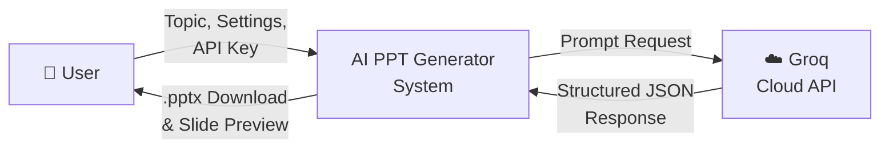
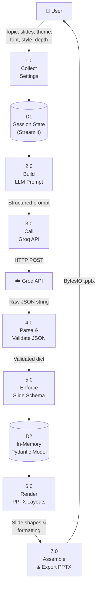
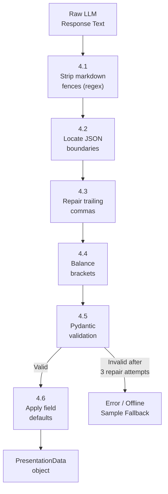

# Data Flow Diagrams

## Figure 5 — DFD Level 0 (Context Diagram)

```mermaid
flowchart LR
    U["👤 User"]
    SYS["AI PPT Generator\nSystem"]
    GROQ["☁️ Groq\nCloud API"]

    U -->|"Topic, Settings,\nAPI Key"| SYS
    SYS -->|".pptx Download\n& Slide Preview"| U
    SYS -->|"Prompt Request"| GROQ
    GROQ -->|"Structured JSON\nResponse"| SYS
```

---

## Figure 6 — DFD Level 1 (System Decomposition)

```mermaid
flowchart TD
    U["👤 User"]

    P1["1.0\nCollect\nSettings"]
    P2["2.0\nBuild\nLLM Prompt"]
    P3["3.0\nCall\nGroq API"]
    P4["4.0\nParse &\nValidate JSON"]
    P5["5.0\nEnforce\nSlide Schema"]
    P6["6.0\nRender\nPPTX Layouts"]
    P7["7.0\nAssemble\n& Export PPTX"]

    DS1[("D1\nSession State\n(Streamlit)")]
    DS2[("D2\nIn-Memory\nPydantic Model")]

    GROQ["☁️ Groq API"]

    U -->|"Topic, slides, theme,\nfont, style, depth"| P1
    P1 --> DS1
    DS1 --> P2
    P2 -->|"Structured prompt"| P3
    P3 -->|"HTTP POST"| GROQ
    GROQ -->|"Raw JSON string"| P4
    P4 -->|"Validated dict"| P5
    P5 --> DS2
    DS2 --> P6
    P6 -->|"Slide shapes &\nformatting"| P7
    P7 -->|"BytesIO .pptx"| U
```

---

## Figure 7 — DFD Level 2: JSON Parsing Subsystem (Process 4.0)

```mermaid
flowchart TD
    IN["Raw LLM\nResponse Text"]
    P41["4.1\nStrip markdown\nfences (regex)"]
    P42["4.2\nLocate JSON\nboundaries"]
    P43["4.3\nRepair trailing\ncommas"]
    P44["4.4\nBalance\nbrackets"]
    P45["4.5\nPydantic\nvalidation"]
    P46["4.6\nApply field\ndefaults"]
    OK["PresentationData\nobject"]
    ERR["Error / Offline\nSample Fallback"]

    IN --> P41
    P41 --> P42
    P42 --> P43
    P43 --> P44
    P44 --> P45
    P45 -->|"Valid"| P46
    P46 --> OK
    P45 -->|"Invalid after\n3 repair attempts"| ERR
```

