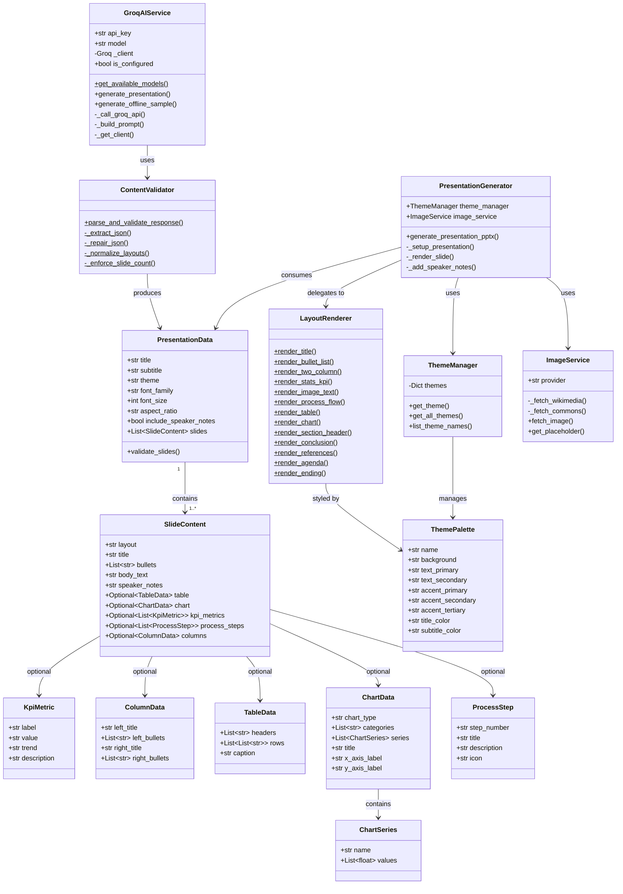

# UML Class Diagram

## Figure 8 — Core Pydantic Schema & Service Classes

```mermaid
classDiagram
    class PresentationData {
        +str title
        +str subtitle
        +str theme
        +str font_family
        +int font_size
        +str aspect_ratio
        +bool include_speaker_notes
        +List~SlideContent~ slides
        +validate_slides()
    }

    class SlideContent {
        +str layout
        +str title
        +List~str~ bullets
        +str body_text
        +str speaker_notes
        +Optional~TableData~ table
        +Optional~ChartData~ chart
        +Optional~List~KpiMetric~~ kpi_metrics
        +Optional~List~ProcessStep~~ process_steps
        +Optional~ColumnData~ columns
    }

    class KpiMetric {
        +str label
        +str value
        +str trend
        +str description
    }

    class ColumnData {
        +str left_title
        +List~str~ left_bullets
        +str right_title
        +List~str~ right_bullets
    }

    class TableData {
        +List~str~ headers
        +List~List~str~~ rows
        +str caption
    }

    class ChartData {
        +str chart_type
        +List~str~ categories
        +List~ChartSeries~ series
        +str title
        +str x_axis_label
        +str y_axis_label
    }

    class ChartSeries {
        +str name
        +List~float~ values
    }

    class ProcessStep {
        +str step_number
        +str title
        +str description
        +str icon
    }

    class ThemePalette {
        +str name
        +str background
        +str text_primary
        +str text_secondary
        +str accent_primary
        +str accent_secondary
        +str accent_tertiary
        +str title_color
        +str subtitle_color
    }

    class GroqAIService {
        +str api_key
        +str model
        -Groq _client
        +bool is_configured
        +get_available_models()$
        +generate_presentation()
        +generate_offline_sample()
        -_call_groq_api()
        -_build_prompt()
        -_get_client()
    }

    class ContentValidator {
        +parse_and_validate_response()$
        -_extract_json()$
        -_repair_json()$
        -_normalize_layouts()$
        -_enforce_slide_count()$
    }

    class PresentationGenerator {
        +ThemeManager theme_manager
        +ImageService image_service
        +generate_presentation_pptx()
        -_setup_presentation()
        -_render_slide()
        -_add_speaker_notes()
    }

    class LayoutRenderer {
        +render_title()$
        +render_bullet_list()$
        +render_two_column()$
        +render_stats_kpi()$
        +render_image_text()$
        +render_process_flow()$
        +render_table()$
        +render_chart()$
        +render_section_header()$
        +render_conclusion()$
        +render_references()$
        +render_agenda()$
        +render_ending()$
    }

    class ThemeManager {
        -Dict themes
        +get_theme()
        +get_all_themes()
        +list_theme_names()
    }

    class ImageService {
        +str provider
        -_fetch_wikimedia()
        -_fetch_commons()
        +fetch_image()
        +get_placeholder()
    }

    PresentationData "1" --> "1..*" SlideContent : contains
    SlideContent --> KpiMetric : optional
    SlideContent --> ColumnData : optional
    SlideContent --> TableData : optional
    SlideContent --> ChartData : optional
    ChartData --> ChartSeries : contains
    SlideContent --> ProcessStep : optional
    GroqAIService --> ContentValidator : uses
    ContentValidator --> PresentationData : produces
    PresentationGenerator --> LayoutRenderer : delegates to
    PresentationGenerator --> ThemeManager : uses
    PresentationGenerator --> ImageService : uses
    PresentationGenerator --> PresentationData : consumes
    LayoutRenderer --> ThemePalette : styled by
    ThemeManager --> ThemePalette : manages
```

