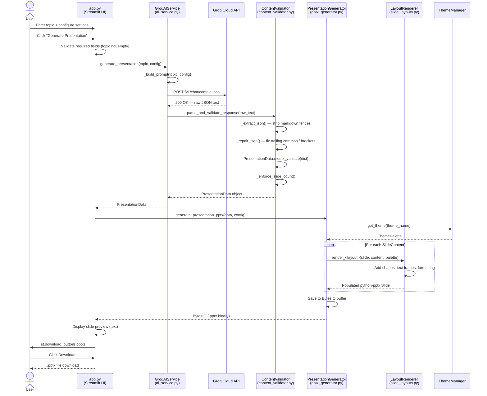
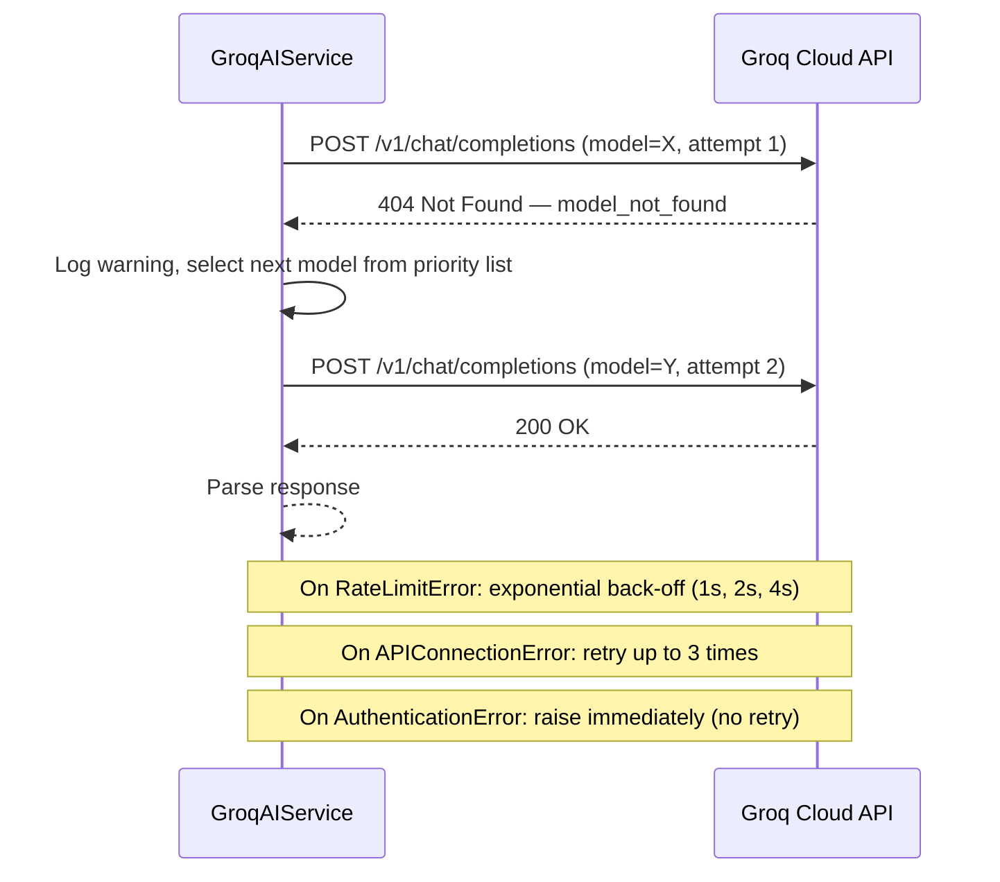

# UML Sequence Diagram

## Figure 9 — End-to-End Presentation Generation Sequence

```mermaid
sequenceDiagram
    actor User
    participant UI as app.py<br/>(Streamlit UI)
    participant AI as GroqAIService<br/>(ai_service.py)
    participant GROQ as Groq Cloud API
    participant VAL as ContentValidator<br/>(content_validator.py)
    participant GEN as PresentationGenerator<br/>(pptx_generator.py)
    participant LAY as LayoutRenderer<br/>(slide_layouts.py)
    participant THM as ThemeManager

    User->>UI: Enter topic + configure settings
    User->>UI: Click "Generate Presentation"
    UI->>UI: Validate required fields (topic not empty)
    UI->>AI: generate_presentation(topic, config)
    AI->>AI: _build_prompt(topic, config)
    AI->>GROQ: POST /v1/chat/completions
    GROQ-->>AI: 200 OK — raw JSON text
    AI->>VAL: parse_and_validate_response(raw_text)
    VAL->>VAL: _extract_json() — strip markdown fences
    VAL->>VAL: _repair_json() — fix trailing commas / brackets
    VAL->>VAL: PresentationData.model_validate(dict)
    VAL->>VAL: _enforce_slide_count()
    VAL-->>AI: PresentationData object
    AI-->>UI: PresentationData
    UI->>GEN: generate_presentation_pptx(data, config)
    GEN->>THM: get_theme(theme_name)
    THM-->>GEN: ThemePalette
    loop For each SlideContent
        GEN->>LAY: render_<layout>(slide, content, palette)
        LAY->>LAY: Add shapes, text frames, formatting
        LAY-->>GEN: Populated python-pptx Slide
    end
    GEN->>GEN: Save to BytesIO buffer
    GEN-->>UI: BytesIO (.pptx binary)
    UI->>UI: Display slide preview (text)
    UI->>User: st.download_button(.pptx)
    User->>UI: Click Download
    UI-->>User: .pptx file download
```

---

## Figure 10 — Error Handling & Model Fallback Sequence

```mermaid
sequenceDiagram
    participant AI as GroqAIService
    participant GROQ as Groq Cloud API

    AI->>GROQ: POST /v1/chat/completions (model=X, attempt 1)
    GROQ-->>AI: 404 Not Found — model_not_found
    AI->>AI: Log warning, select next model from priority list
    AI->>GROQ: POST /v1/chat/completions (model=Y, attempt 2)
    GROQ-->>AI: 200 OK
    AI-->>AI: Parse response

    note over AI,GROQ: On RateLimitError: exponential back-off (1s, 2s, 4s)
    note over AI,GROQ: On APIConnectionError: retry up to 3 times
    note over AI,GROQ: On AuthenticationError: raise immediately (no retry)
```

